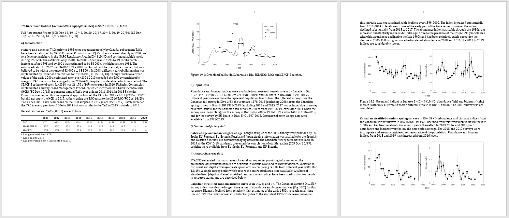

---
output:
  md_document:
    variant: markdown_github
---

```{r, include = FALSE}
knitr::opts_chunk$set(
  collapse = TRUE,
  comment = "#>"
)
```


```{r setup, echo = FALSE}
library(NAFOdown)
word_out <- knitr::opts_knit$get("rmarkdown.pandoc.to") == "docx"
```


```{r word-out, eval = word_out, results = "asis", echo = FALSE}
cat(
    '---',
    'title: "NAFOdown: An R Markdown Template for Producing NAFO Scientific Council Documents"',
    'author: "Paul M. Regular^1^, Bob Rodgers^1^, Laura Wheeland^1^, Sean C. Anderson^2^"',
    'date: |',
    "   ^1^Northwest Atlantic Fisheries Centre, Fisheries and Oceans Canada, P.O.Box 5667, St. John’s, NL, A1C 5X1, Canada\\",
    "   ^2^Pacific Biological Station, Fisheries and Oceans Canada, 3190 Hammond Bay Rd., Nanaimo, British Columbia, V9T 6N7, Canada",
    '---',
    sep = "\n")

```


`r if (!word_out) "[](https://github.com/nafc-assess/NAFOdown/actions)"`

`r if(!word_out) "# NAFOdown" else "# Introduction"`

```{r logo, echo = FALSE, fig.height = 0.01, out.width = "150px", out.height = "150px", out.extra='style="float:right; padding:10px"', eval = !word_out}

```

NAFOdown is an R package designed to simplify the process of creating and updating NAFO documents. The package utilizes the [bookdown](https://bookdown.org/yihui/bookdown/) package which facilitates the integration of Markdown syntax and R code and, as such, effectively provides a "one-stop-shop" tool through which analyses, plots, tables, and text can be written in parallel and knit into a stand-alone and reproducible document. Such a workflow minimizes the significant amount of manual effort associated with coping and pasting data, summary statistics and plots from one program to another. This approach also minimizes the amount of time spent on formatting documents as the NAFOdown package, like the [csasdown](https://github.com/pbs-assess/csasdown/) and [thesisdown](https://github.com/ismayc/thesisdown/) packages which this package is based on, includes templates that conform to formatting guidelines. Specifically, NAFOdown includes templates for producing SCR, STACFIS, and SCS documents in Word format. Here we demonstrate how to use this package.

`r if(!word_out) "##" else "#"` Installation

The statistical computing program [R](https://www.r-project.org/) is required to use the NAFOdown package and we highly recommend using [RStudio](https://www.rstudio.com/products/RStudio/) to manage an R projects. With RStudio installed a project can be started in an existing or new directory using the drop-down menus in Rstudio. After setting up a project, Rstudio will generate a .Rproj file which will automatically set the working directory to the project folder when this file is opened. This will simplify the process of telling R where to find the files needed for the report.

NAFOdown can be installed via GitHub using this code:

``` r
# install.packages("remotes")
remotes::install_github("nafc-assess/NAFOdown")
```

`r if(!word_out) "##" else "#"` Starting a document

A skeleton of a NAFO document will be produced and stored in your working directory by running this code:

``` r
getwd() # this is where files and folders of the skeleton will be saved
NAFOdown::draft(report_type = "SCR")
```

The type of skeleton produced can be changed by changing the `report_type` argument from `"SCR"` to `"STACFIS"` or `"SCS"`. The components of the skeleton are outlined below. Note that all of the files included in the skeleton are text based and can be opened and edited using RStudio.

`r if(!word_out) "###" else "##"`  Components of the skeleton

`r if(!word_out) "####" else "###"`  `index.Rmd`

This is a key file that contains all the meta information that defines much of the formatting of the document as well as the information for the beginning of the document. Several of these items will need to be edited, such as the author, title, etc. 

`r if(!word_out) "####" else "###"` `01_body.Rmd`, `02_references.Rmd`, etc.

These are the .Rmd files for each section of the report. These files will hold all the markdown text and R code (e.g. tables and figures) needed to produce the document. Note that the SCR template includes a series of .Rmd files (`01_body.Rmd`, `02_references.Rmd`, and `03_appendix.Rmd`), as these reports can be extensive, while the STACFIS and SCS templates are simpler and only includes a `body.Rmd` file.

`r if(!word_out) "####" else "###"` `_bookdown.yml`

This file outlines the .Rmd files to be combined by bookdown. This is also where some options are modified such as the prefix for table and figure captions (e.g. Figure instead of Fig.). Depending on the use case, specific components may not be needed and these files can be excluded from the .Rmd file list contained within this file (e.g. `appendix.Rmd`). Alternatively, for extensive SCR documents, it may be useful to create and specify separate `01_introduction.Rmd`, `02_methods.Rmd`, `03_results.Rmd`, and `04_discussion.Rmd` files in lieu of one large `01_body.Rmd`.

`r if(!word_out) "####" else "###"` `csl`

This folder holds the style files for bibliographies, specified using a citation style language file (.csl). Currently, SCR documents will follow the Harvard citation format. This folder is not included in the STACFIS or SCS templates as references are rarely used.

`r if(!word_out) "####" else "###"` `bib`

BibTeX references are to be included in the `refs.bib` file inside this folder. BibTeX entries can be exported from most journal web-pages, Google scholar and from reference managers such as [Zotero](https://www.zotero.org/). Copy this text into the `refs.bib` file and note the tag used for each entry as this is what will be used to reference specific papers. Also consider using the Rstudio [citr](https://github.com/crsh/citr) add-in to simplify the insertion of citations.

`r if(!word_out) "##" else "#"` Writing

`r if(!word_out) "###" else "##"` Markdown

NAFOdown is build upon the [bookdown](https://bookdown.org/yihui/bookdown/) package which is build upon [R markdown](http://rmarkdown.rstudio.com). In short, R markdown provides a reproducible authoring framework for scientist as a single file can be used to embed chunks of code from R, and other languages, into a Markdown document. Markdown is a simple plain text formatting syntax that can be converted to a wide range of outputs, such as HTML. The format is easy-to-read and the fact that it detaches writing from formatting allows authors to focus on writing. Pairing R with Markdown creates a very flexible and efficient platform for producing a wide range of documents. See the bookdown book on bookdown for more details on its capabilities (https://bookdown.org/yihui/bookdown/).

`r if(!word_out) "###" else "##"` Tables

Tables included in NAFO documents are often extensive and, as such, we recommend the use of the [flextable](https://davidgohel.github.io/flextable/index.html) package. Tables produced using this package are highly customizable and a theme function, `NAFOdown::theme_nafotabs()`, has been added to this package to facilitate consistent formatting of tables in NAFO documents.

`r if(!word_out) "###" else "##"` Figures

NAFOdown also includes a [ggplot2](https://ggplot2.tidyverse.org/) theme, `NAFOdown::theme_nafo()` to aid the consistent formatting of figures. The theme is specific to the ggplot2 package because it is a widely used package that is extremely flexible and capable of producing figures typically used in NAFO documents.

`r if(!word_out) "##" else "#"` Meeting-to-meeting writing

As noted above, several of the files need to be populated with content. In most cases, the `body.Rmd` file will hold most of the content and take the most time to draft. Moreover, these documents may evolve over time. Managing a series of drafts can be a cumbersome task and, as such, we recommend that versions are tracked using a version control system such as Git. Rstudio integrates nicely with Git and the hosting service GitHub, and thereby provides a platform for syncing versions with an online repository (i.e. this acts as a back-up and facilitates remote collaboration). For a gentle guide to getting starting with using Git and GitHub with R and RStudio, see http://happygitwithr.com/.

`r if(!word_out) "##" else "#"` Rendering

To render a NAFO report in Word format, open `index.Rmd` in Rstudio and click the "knit" button:

```{r knit, echo = FALSE, out.width = "600px"}
knitr::include_graphics("man/figures/knit.png")
```

Documents can also be rendered in the R console, assuming the working directory is set to the directory holding the `index.Rmd` file, using bookdown's `render` function:

```r
bookdown::render_book("index.Rmd")
```
The rendered Word file will be saved in the `_book/` directory. When all files are populated with the necessary content, the output will look similar to past documents:


```{r stacfis, echo = FALSE, out.width = "100%"}

```

While there is an initial cost to building these documents, they will be much easier to update following the addition of new data as all tables and figures should automatically update. This workflow will also improve the transparency and reproducibility of the work, especially if changes are tracked using git.

`r if(!word_out) "##" else "#"` Contributing

This is an open project and we welcome constructive feedback. Please report problems and/or make suggestions under the [issues](https://github.com/nafc-assess/NAFOdown/issues) page. Also feel free to activity contribute to the package by submitting changes under the [pull requests](https://github.com/nafc-assess/NAFOdown/pulls) page.


