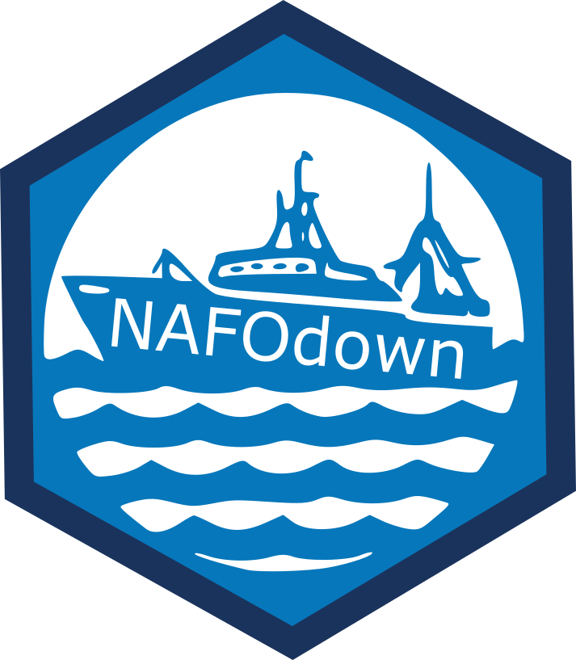

# NAFOdown

<!-- badges: start -->
<!-- badges: end -->

<a href=""></a>

NAFOdown uses the bookdown package to create NAFO documents, such as SCRs or STACFIS reports, in Word format. The goal of this package is to encourage reproducible research using simple Markdown syntax and embedded R code, and facilitate the process of producing or updating  scientific documents that consistently follow NAFO formatting guidelines. This package is based on Sean Anderson's (csasdown)[https://github.com/pbs-assess/csasdown] and Chester Ismay's (thesisdown)[https://github.com/ismayc/thesisdown].

## Installation

You can install NAFOdown via github:

``` r
# install.packages("devtools")
devtools::install_github("PaulRegular/NAFOdown")
```

## Example

Once the package is installed, this line of code will produce a skeleton of the files and folders for producing a NAFO SCR:

``` r
NAFOdown::draft("SCR")
```

and this line will produce the skeleton of a STACFIS report:

``` r
NAFOdown::draft("STACFIS")
```

You'll need to edit the individual Rmd files to produce your report. To render your document, open `index.Rmd` in RStudio and click the "knit" button.


